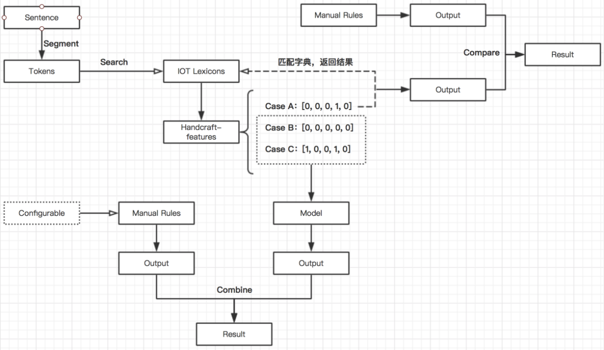
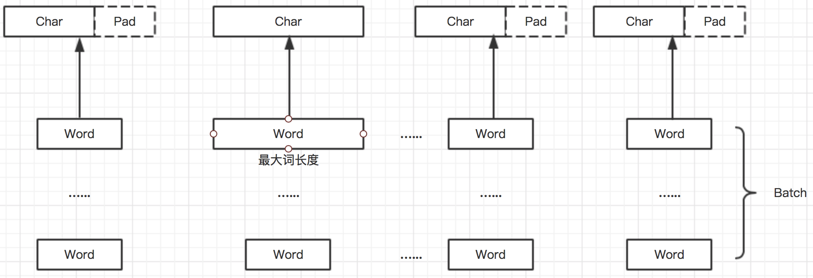

## 系统架构

## 模型结构

### Padding策略

- 传统的Padding方法：  
在Batch中，将句子Pad至word 级别的长度；再将句子Pad至char 级别的长度。  

- 优化策略：  
    - 在一个batch中，将句子padding至word 级别的长度；  
    - 当前batch中，选择最长的词的长度，作为char Padding的长度。

- 例：
Batch = B，所有句子中，最大句子长度为m，最大词的长度为n，则做char Padding时，batch会转变为 (B, m, n) 的矩阵；
假如embedding维度为300，再将矩阵变换一下，一个batch转变为(B * m, n, 300)的维度，这样操作比传统padding方法更节省时间和空间。

## 特征处理
说明：代码中我没有将特征处理的部分放出来，dataset中的特征已是处理好特征的数据集，如
"|  河南省 [Lexi]1 B-LOC  |"，中间的"1"代表的就是某一特征类型，下面是处理思路：  
- 构建辞典，以常见的Ner类别距离，构建[人名]、[地名]、[机构名]、[公司名]；  
- 对原有句子做切词处理，对切词后的word做字典树搜索；  
- 搜索结果，"1"表示存在，"0"表示不存在，会得到一组结构特征，如word:'周杰伦'的搜索结果是[1,0,0,0]，我
将所有词的搜索存在了embedding/feat_emb.txt；  
- 这时可以有两个做法，你可以直接将类似one-hot的特征编码，拼接到word embedding的层面做fine-tune；第
二种做法是抽象到一个特征类别，做embedding化的处理；  

## 推理过程
根据系统架构图，我们可以发现：  
- 分词后，我们对句子中的每一个词进行匹配检索，针对每一个词，会得到三种结果：  
    a.该词不存在于任意一个辞典中；  
    b.该词仅存在于一个辞典中；  
    c.该词存在两个或两个以上的辞典中；  
- 根据上一步的处理结果，会得到句子中每一个词的结构化特征，此时句子根据词的结构化特征分布，会分为三类：
    a.句子中的每一个词，都仅存在于一个辞典中；  
    b.句子中有一个以上的词，不存在于任意一个辞典中；  
    c.句子中有一个以上的词，存在于两个或两个以上的辞典中；  
    （这里其实对应系统架构图中Case A、B、C）
- 结构化特征分布：
    - 分布结果属于a，则会进入规则层，按照辞典的类型直接给予每个词相应的标签； 
    - 句子的结构化特征分布结果属于类别b或c，则会进入模型层，模型的序列标注结果会输出在每一个词上；  
- 无论是依靠字典或是模型的输出结果，都需要与配置层结合输出最终结果。配置层即图中的Manual Rules。  

## 关于推理过程加速
1.动态RNN的机制，pytorch中的pack_pad_sequence策略改变来CRF解码前的输入，在batch中做推理时，就不用解码至batch的最大长度；  
2.线上实际推理中，未对句子做padding，因此viterbi的实际解码次数 = 句子实际长度 - 1  
结论：加速效果非常明显，单条句子实测从30ms下降至5ms；  

- 这里会引发一个问题：  
训练过程padding，推理过程不做padding，结果是否会出现不一致？  
其实与不同的模型策略有关，后续补充。。  

## 可解释性：（待补充）
- 中文NER的标签做到词级别，可以增强模型的可解释性，增强系统的Debug功能
 
## 迁移学习应用
通过增量训练，让模型覆盖到某一类型到句子，同时，不用花大量时间重复训练；  
- 路径：transfer.py  

## 配置层
- 路径：pattern/  
说明：规则模版及badcase的配置及应用  
  
- 路径：phone/  
说明：专门抓取电话号码的配置及应用  

## 模型训练：
- 路径：main.py  
- 参数配置：model/cnn_lstm_crf.py

## 模型推理：
entity_parse.py  
实现顺序：  
- phone_num识别;  
- badcase识别;  
- pattern识别;  
- 模型识别;  